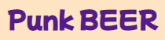

<p align="center">
  <a href="" rel="noopener">
 </a>
</p>

<div align="center">

</div>

---

<p align="center">This project been made during week 6 of software course with _nology. Main goal of this application was to implement knowledge about React framework into practice
    <br> 
</p>

## 📝 Table of Contents

- [About](#about)
- [Getting Started](#getting_started)

- [Usage](#usage)
- [Built Using](#built_using)

- [Authors](#authors)

## 🧐 About <a name = "about"></a>

This web based application allowed you to search over Brewdog Punk API for your favourite beer.

## 🏁 Getting Started <a name = "getting_started"></a>

These instructions will get you a copy of the project up and running on your local machine for development and testing purposes. See [deployment](#deployment) for notes on how to deploy the project on a live system.

Clone repo to youre local machine with :

```
git clone
```

Open repo in youre code edditor then install node modules by typing in yours terminal following command :

```
npm install
```

Also you need to install sass dependancy by typing in yours terminal

```
npm install sass --save-dev
```

Last step is to open local server by running following comend in terminal

```
npm run start
```

## 📸 Screenshots <a name = "screenshots"></a>

<div>


</div>

## 🎈 Usage <a name="usage"></a>

- Type in search box desired name of beer to get more information about it
- To filter beers aginst specific paramiter use filter options provided
- To find more information about beer press beer card
- To go back to main page press LOGO

## ⛏️ Built Using <a name = "built_using"></a>

<div>


</div>

## ✍️ Authors <a name = "authors"></a>

- [@michalweclawik](https://github.com/michalweclawik) - Idea & Initial work
